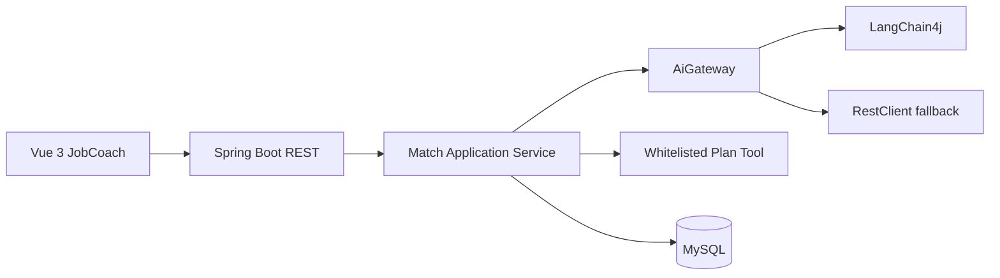

# 03 架构设计

```mermaid
flowchart LR
  UI[Vue 3 JobCoach] --> API[Spring Boot REST]
  API --> APP[Match Application Service]
  APP --> AI[AiGateway]
  AI --> L4J[LangChain4j]
  AI --> HTTP[RestClient fallback]
  APP --> TOOL[Whitelisted Plan Tool]
  APP --> DB[(MySQL)]
```

业务层依赖 `AiGateway`，避免绑定单一 AI 框架。模型输出必须经过 Jackson 映射和校验，准备计划工具必须显式注册、校验参数并记录执行结果。
