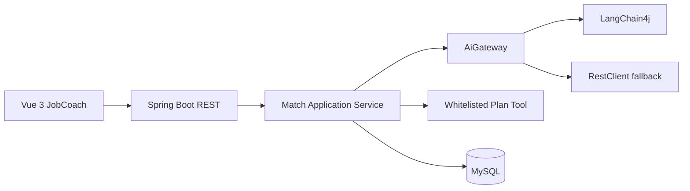

# 架构设计概览

这是一份跨文档架构概览；具体功能边界和接口字段以带编号的产品规格为准。

业务层依赖 `AiGateway`，避免绑定单一 AI 框架。模型输出必须经过 Jackson 映射和校验，准备计划工具必须显式注册、校验参数并记录执行结果。

## 分阶段实施方案

1. **阶段 A：Fake 闭环**。先完成 Web → Application → Domain → Fake gateway → 响应，验证输入、错误和页面状态。
2. **阶段 B：真实 AI adapter**。只替换 `AiGateway` 实现；保留 fake 回归集，先测文本再测结构化输出。
3. **阶段 C：受控工具**。先做用户确认和无副作用校验，再接保存计划；记录执行步骤、幂等键和失败原因。
4. **阶段 D：持久化**。MySQL 可用且隐私策略确认后，再保存会话、报告、计划和执行记录；先迁移、再 Repository、再集成测试。
5. **阶段 E：RAG/增量能力**。以无检索基线对比，只有质量或可解释性有稳定收益才纳入主流程。

每阶段都必须能单独构建、测试和回滚；下一阶段不能用“代码已写”替代上一阶段的行为证据。

## 架构风险与控制

| 风险 | 控制点 |
|---|---|
| provider SDK 泄漏到业务层 | `AiGateway` 端口和 adapter 转换 |
| 模型输出驱动越权 | Schema + 领域规则 + 工具授权 |
| 持久化导致隐私扩大 | 默认不存原文，先完成保留/删除评审 |
| 分层变空壳 | 每层至少有可测试职责，不为目录而抽象 |
