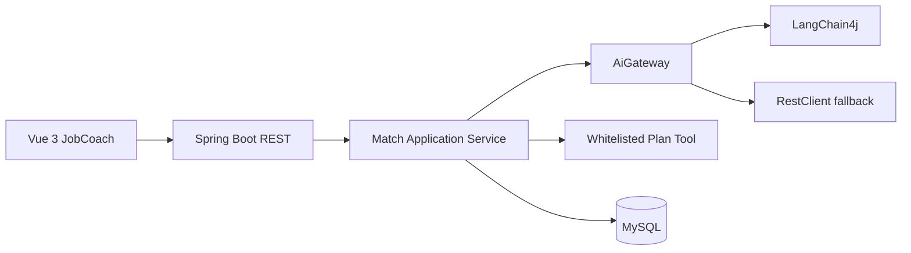

# 产品概览

这是一份跨文档概览；具体 MVP 范围、功能条目和接口字段以带编号的产品规格为准（`02-mvp-scope.md`、`06-api-contract.md`、`07-error-model.md`）。

## 需求与边界

用户输入岗位描述和个人简历/项目经历，系统返回岗位匹配分析、证据、技能差距和求职准备建议。

目标主流程：岗位/经历输入校验 → 模型分析 → 结构化解析 → 受控工具保存准备任务 → 持久化执行步骤 → Vue 展示。当前 MVP 只实现到报告展示；工具保存和持久化属于后续路线。

第一版不实现登录、复杂权限、多 Agent、复杂 Workflow、生产部署、向量数据库和自动修改代码。

验收：岗位和经历可提交、结果结构稳定、模型失败有错误态且不持久化；后续路线再验收工具只能保存允许的准备任务、执行记录可查询和不泄露密钥。

### 需求落地步骤

1. 先从用户流程提取输入、状态、输出和副作用，不直接从模型能力倒推需求。
2. 为每个需求写正常、边界、失败和恢复场景；没有用户动作或可观察结果的需求暂不实现。
3. 将需求映射到 API、领域对象、前端状态、测试和文档；每条至少有一个验收证据。
4. 标记需求来源：用户确认、产品草案、工程约束、外部建议；不同来源不得互相冒充。
5. 变更需求时更新 MVP、API、错误模型、演示脚本和实现边界，避免只改一份文档。

### 需求验收矩阵

| 需求 | 用户动作 | 可观察结果 | 失败恢复 | 证据 |
|---|---|---|---|---|
| 输入资料 | 填写并提交 | 校验通过或明确错误 | 修改后重试 | API/UI 测试 |
| 匹配报告 | 等待分析 | 结构化报告和证据 | 模型失败可重试 | fake/模型实验 |
| 保存计划（后续路线） | 显式确认 | 任务和状态可查询 | 重复调用幂等 | 工具/集成测试 |

## 架构



业务层依赖 `AiGateway`，避免绑定单一 AI 框架。模型输出必须经过 Jackson 映射和校验，准备计划工具必须显式注册、校验参数并记录执行结果。

### 分阶段实施方案

1. **阶段 A：Fake 闭环**。先完成 Web → Application → Domain → Fake gateway → 响应，验证输入、错误和页面状态。
2. **阶段 B：真实 AI adapter**。只替换 `AiGateway` 实现；保留 fake 回归集，先测文本再测结构化输出。
3. **阶段 C：受控工具**。先做用户确认和无副作用校验，再接保存计划；记录执行步骤、幂等键和失败原因。
4. **阶段 D：持久化**。MySQL 可用且隐私策略确认后，再保存会话、报告、计划和执行记录；先迁移、再 Repository、再集成测试。
5. **阶段 E：RAG/增量能力**。以无检索基线对比，只有质量或可解释性有稳定收益才纳入主流程。

每阶段都必须能单独构建、测试和回滚；下一阶段不能用“代码已写”替代上一阶段的行为证据。

### 架构风险与控制

| 风险 | 控制点 |
|---|---|
| provider SDK 泄漏到业务层 | `AiGateway` 端口和 adapter 转换 |
| 模型输出驱动越权 | Schema + 领域规则 + 工具授权 |
| 持久化导致隐私扩大 | 默认不存原文，先完成保留/删除评审 |
| 分层变空壳 | 每层至少有可测试职责，不为目录而抽象 |

## API

`POST /api/matches`：请求岗位描述和个人经历文本，响应岗位要求、匹配证据、技能差距、风险和建议。

```json
{
  "jobDescription": "Java 后端工程师，要求 Spring Boot 和 AI 应用经验",
  "profile": "软件工程大四，完成过 Java Web 项目"
}
```

第一版暂不返回持久化的执行 ID；持久化将在 MySQL 环境可用后加入。

`GET /api/executions/{executionId}`：后续阶段查询执行记录。

`GET /api/project-rules`：查询项目规则；第一版可返回固定规则，后续迁移到 MySQL 或 RAG。

### API 设计步骤

1. 先写用户动作和状态转换，再决定是否新增 endpoint；不要为未来功能提前造完整 REST 资源。
2. 为每个 endpoint 定义请求字段、长度、错误 code、成功响应、幂等行为和日志脱敏规则。
3. 用 fake gateway 写成功/失败/非法输出测试，再用真实 HTTP 测试状态码和错误契约。
4. 只有出现跨请求状态、查询、重试或用户确认需求时，才引入 `executionId`、历史接口或异步状态。
5. API 变更必须同步前端类型、README、演示脚本和错误模型，并记录兼容/迁移策略。

### 当前接口验收顺序

1. `POST /api/matches`：输入校验和 fake 成功响应。
2. 模型失败/超时/非法结构：错误 code、可重试性和无伪造报告。
3. 准备计划确认接口：用户确认、幂等和工具执行记录。
4. 查询接口：只有持久化和历史需求确认后加入，避免提前扩大范围。